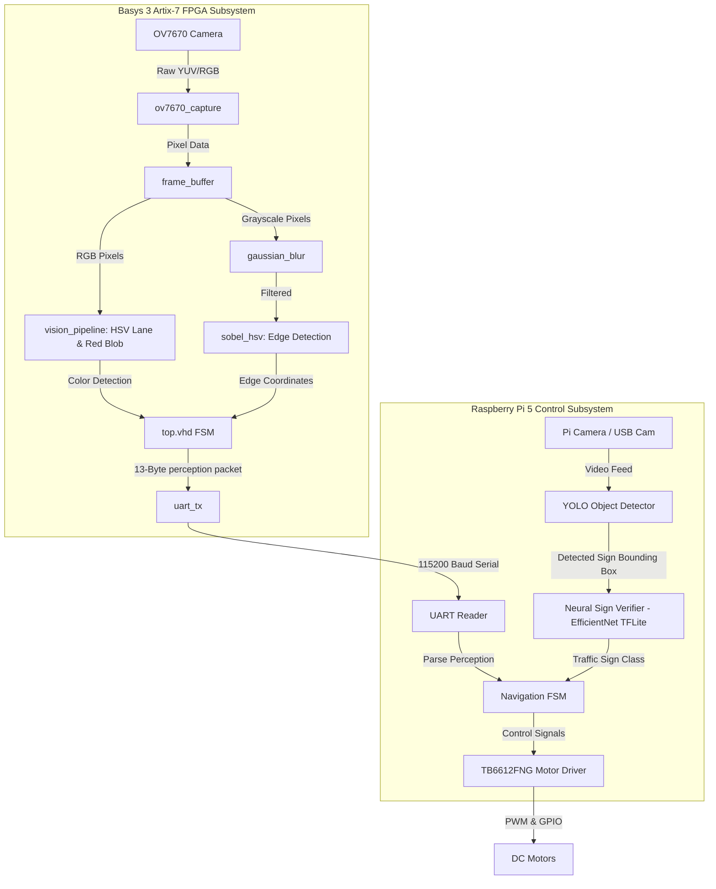

# Real-Time Autonomous Car with FPGA Vision Pipeline & Raspberry Pi 5 Control

This repository contains the complete hardware-software co-design implementation for a real-time autonomous vehicle. The system leverages a **Basys 3 Artix-7 FPGA** for high-speed hardware vision processing and a **Raspberry Pi 5** for navigation, motor control, object detection (YOLO), and traffic sign verification (EfficientNet).

---

## 🛠️ System Architecture

The vehicle is split into a **Hardware Perception Subsystem** (FPGA) and a **Decision/Control Subsystem** (Raspberry Pi 5):



---

## 1. 🎛️ FPGA Hardware Vision Subsystem (Basys 3 Artix-7)

The Basys 3 FPGA processes real-time video frames directly from the OV7670 camera at 100MHz. It handles image capture, pixel buffering, color space transformation, blur filtering, edge detection, and data packaging in pure VHDL.

### Key Hardware Modules
*   **ov7670_capture.vhd**: Directly interfaces with the OV7670 camera sensor. It synchronizes with the `PCLK`, `HREF`, and `VSYNC` camera timing signals, converts incoming pixels to RGB565 format, and writes them into dual-port memory.
*   **frame_buffer.vhd**: A dual-port Block RAM structure acting as a line and frame buffer. It allows the capture module to write incoming pixels while the processing pipeline simultaneously reads them.
*   **vision_pipeline.vhd**:
    *   **Color Conversion**: Transforms RGB565 data into Hue, Saturation, and Value (HSV) color space in real-time.
    *   **HSV Lane Detection**: Identifies left and right lane boundaries using loosened, robust hue thresholds calibrated for physical environments.
    *   **Red Blob (Sign) Detection**: Targets red traffic signs and calculates their bounding coordinates and centroid offset.
*   **gaussian_blur.vhd**: A 3x3 kernel sliding window filter designed to smooth high-frequency noise from the raw camera sensor before passing the image to the edge detector.
*   **sobel_hsv.vhd**: Performs vertical and horizontal Sobel filtering to extract clean edge gradients, which are used to verify lane alignments and sign shapes.
*   **top.vhd**: The orchestrating Finite State Machine (FSM). It sequences the pipeline, coordinates color detection/edge extraction, and compiles the perception parameters into a deterministic **13-byte serial packet** (header `0xAA`, sign classification, confidence rating, lane coordinates, error flags).
*   **uart_tx.vhd**: Transmits the structured 13-byte data packet to the Raspberry Pi over a serial link at a baud rate of **115200bps**.

---

## 2. 🧠 Raspberry Pi 5 AI Perception & Control Subsystem

The Raspberry Pi 5 acts as the vehicle's brain, running the high-level navigation logic and executing deep learning models in Python.

### Core Software Stack
*   **UART Serial Reader**: Actively reads and parses the 13-byte perception packets transmitted by the FPGA.
*   **YOLO Object Detector (Ultralytics)**: Runs real-time object detection on an auxiliary USB/Pi camera feed to locate signs, obstacles, or markers.
*   **Neural Sign Verifier (EfficientNet)**:
    *   A deep convolutional neural network trained on the **German Traffic Sign Recognition Benchmark (GTSRB)** dataset.
    *   Takes bounding boxes cropped by YOLO and classifies the sign (e.g., *Speed Limit, Stop, Yield*).
    *   Optimized into highly efficient **TensorFlow Lite (FP16 & INT8)** formats for low-latency inference directly on the Pi 5's CPU.
*   **Navigation FSM**: Receives processed lane positions and sign classes, and executes safety FSM algorithms (e.g., stop at red signs, slow down in speed zones, follow lanes).
*   **TB6612FNG Motor Driver Interface**: Translates navigation decisions into hardware actions, sending PWM signals and direction pins to the TB6612FNG H-bridge to drive the DC motors.

---

## 3. 🔍 Resolved Timing & Hardware Challenges (Debugging Log)

During development, multiple complex hardware/software timing bugs were identified and fixed to make the system fully functional:

### FPGA Fixes
1.  **SCCB Initialization Deadlock (`sccb_ov7670.vhd`)**:
    *   *Issue*: The FSM for configuring camera registers was checking if `sccb_busy = '1'` too fast (in 1 clock cycle), skipping the setup sequence and leaving the board stuck with only **LED 0** turned on.
    *   *Fix*: Modified the state machine to lock the write enable (`wr_en`) signal to HIGH *until* the `sccb_busy` flag explicitly rises to `'1'`, ensuring the slower 100kHz I2C protocol receives the request.
2.  **VSYNC Polarity Reversal (`ov7670_capture.vhd`)**:
    *   *Issue*: The capture module was incorrectly sampling pixels during vertical blanking (VSYNC HIGH) and ignoring the active frames (VSYNC LOW).
    *   *Fix*: Inverted the edge logic. Pixel sampling is now triggered on the VSYNC falling edge (start of frame) and paused on the rising edge.
3.  **UART Double-Transmission Packet Mangling (`top.vhd`)**:
    *   *Issue*: The 1-clock-cycle delay of `uart_ready` dropping caused the state machine to send byte values twice, resulting in truncated 7-byte packets rather than the full 13 bytes.
    *   *Fix*: Added a locking condition `if uart_ready='1' and uart_valid='0'` to force the state machine to await a complete transmission cycle before loading the next byte.
4.  **HSV Threshold Calibration (`vision_pipeline.vhd`)**:
    *   *Issue*: Ambient lighting washed out red hues, preventing red signs from being detected under standard indoor lighting.
    *   *Fix*: Relaxed thresholds to check for *relative dominance* (R > G AND R > B) rather than absolute color purity.

### Raspberry Pi 5 Fixes
1.  **SOC Base Address Error (`modules.py`)**:
    *   *Issue*: Running the script triggered `RuntimeError: Cannot determine SOC peripheral base address` because the Pi 5's custom RP1 GPIO chip is incompatible with the legacy `RPi.GPIO` library.
    *   *Fix*: Uninstalled the old library and compiled `rpi-lgpio` using `swig`, restoring seamless drop-in GPIO compatibility.
2.  **Sudo Privilege Virtual Environment Escape**:
    *   *Issue*: Launching with `sudo python3 main.py` failed to locate Python packages like `ultralytics` because `sudo` switches to the system's root environment.
    *   *Fix*: Executed the program by pointing `sudo` directly to the virtual environment's isolated executable:
        ```bash
        sudo /home/admin/autonomous_env/bin/python main.py
        ```

---

## 4. 🚀 Installation & Running Guide

### A. FPGA Setup
1.  Open **Vivado (2020.1 or newer)**.
2.  Import the project located under `FPGA/autonomous_car_final`.
3.  Select the **Basys 3** target board (`xc7a35tcg224-1`).
4.  Run **Synthesis**, **Implementation**, and **Generate Bitstream**.
5.  Program the Basys 3 board using the hardware manager.
    *   *Status LEDs*: **LED 0** will turn ON then OFF (Camera config done). **LED 1** turns ON solids (Camera ready). **LED 2** blinks rapidly (active frame capturing).

### B. Raspberry Pi 5 Setup
1.  Install the required system dependency for the GPIO driver:
    ```bash
    sudo apt update
    sudo apt install -y swig
    ```
2.  Create and activate your Python virtual environment:
    ```bash
    python3 -m venv autonomous_env
    source autonomous_env/bin/activate
    ```
3.  Install dependencies:
    ```bash
    pip install rpi-lgpio ultralytics opencv-python tensorflow-lite
    ```
4.  Connect the Basys 3 PMOD pins (UART TX/GND) to the Raspberry Pi 5 RX pin (GPIO 15 / UART RX) and GND.
5.  Execute the main controller using the absolute virtual environment path:
    ```bash
    sudo /home/admin/autonomous_env/bin/python main.py
    ```

---

## 📈 System Metrics & Output Details
*   **FPGA Frame Rate**: Up to **30 FPS** at QQVGA resolution.
*   **UART Baud Rate**: **115200 bps**.
*   **Perception Data Packet**: 13 bytes structured as:
    `[0xAA (Header), Sign_Class, Confidence, Left_Lane_Pos, Right_Lane_Pos, ...]`
*   **Motor Driver**: TB6612FNG controlled via hardware PWM for speed adjustment and digital GPIO pins for forward/reverse control.
